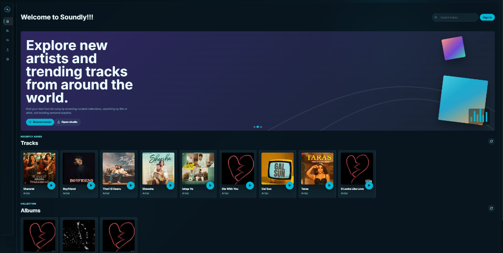
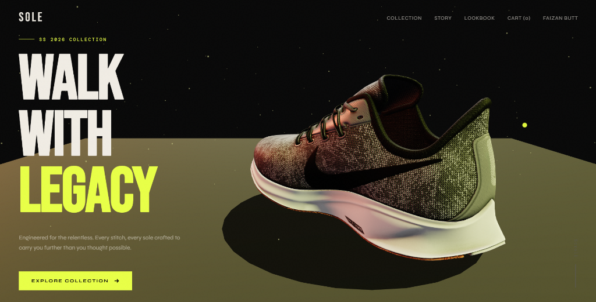

# Muhammad Faizan

**Digital Craftsman & Full Stack Developer**  
*Building elegant, component-driven interfaces and turning creative concepts into high-speed full-stack products.*

---

### 💼 Professional Summary

I am a **Digital Craftsman & Full Stack Developer** based in Lahore, Pakistan. Dedicated to building elegant, component-driven interfaces and turning creative concepts into high-speed full-stack products, I focus on crafting responsive, clean frontends and connecting them to robust database layers.

* **Frontend Stack:** React 19, Tailwind CSS v4, JavaScript (ES6+), Vite, and React Router DOM.
* **Backend Stack:** Node.js and MongoDB.
* **My Focus:** Writing reusable components, styling fluid responsive grids, and managing data flows.
* **Inquiries:** Open to collaborations, freelance projects, and developer roles at [buttzan1234@gmail.com](mailto:buttzan1234@gmail.com)

---

### 🛠️ Technical Stack

&nbsp;

---

### 💻 Digital Showcase

  <!-- Project 1: Soundly -->
  <table border="0" width="100%">
    <tr>
      <td width="55%" valign="middle" align="left">
        <h3>🎵 Soundly — Audio Streaming Platform</h3>
        
A premium music and audio streaming web application. Features interactive audio playback, playlist management, responsive player dashboards, and structured audio data flow.

        

          <code>React JS</code> &bull; <code>Tailwind CSS</code> &bull; <code>Node.js</code> &bull; <code>MongoDB</code>
        

        

          <a href="#"><b>Codebase</b></a> &nbsp;|&nbsp; <a href="https://soundly-tan.vercel.app" target="_blank"><b>Live Demo</b></a>
        

      </td>
      <td width="45%" valign="middle" align="center">
        
      </td>
    </tr>
  </table>

    

  <!-- Project 2: SOLE Footwear -->
  <table border="0" width="100%">
    <tr>
      <td width="45%" valign="middle" align="center">
        
      </td>
      <td width="55%" valign="middle" align="left" style="padding-left: 20px;">
        <h3>👟 SOLE Footwear — E-Commerce Platform</h3>
        
A high-end e-commerce platform specializing in footwear. Features responsive product grids, shopping cart management, user search, and interactive checkout systems.

        

          <code>HTML</code> &bull; <code>CSS</code> &bull; <code>Three.js</code> &bull; <code>MongoDB</code> &bull; <code>Node.js</code>
        

        

          <a href="#"><b>Codebase</b></a> &nbsp;|&nbsp; <a href="#"><b>Live Demo</b></a>
        

      </td>
    </tr>
  </table>

    

  <!-- Project 3: What EF -->
  <table border="0" width="100%">
    <tr>
      <td width="55%" valign="middle" align="left">
        <h3>🚀 What EF — Full-Stack Web Application</h3>
        
A full-stack interactive web application built with a React frontend and Node.js backend. Handles data-heavy components, custom routing systems, and database queries.

        

          <code>React 19</code> &bull; <code>Tailwind CSS v4</code> &bull; <code>Node.js</code> &bull; <code>MongoDB</code>
        

        

          <a href="#"><b>Codebase</b></a> &nbsp;|&nbsp; <a href="#"><b>Live Demo</b></a>
        

      </td>
      <td width="45%" valign="middle" align="center">
        
      </td>
    </tr>
  </table>

    

  <!-- Project 4: Nexus -->
  <table border="0" width="100%">
    <tr>
      <td width="45%" valign="middle" align="center">
        
      </td>
      <td width="55%" valign="middle" align="left" style="padding-left: 20px;">
        <h3>💼 Nexus — Team Productivity Hub</h3>
        
A sleek software platform and collaborative space designed for team productivity. Integrates dashboard layouts, secure access layers, and dynamic UI panels.

        

          <code>React 19</code> &bull; <code>Tailwind CSS v4</code> &bull; <code>Vite</code>
        

        

          <a href="#"><b>Codebase</b></a> &nbsp;|&nbsp; <a href="#"><b>Live Demo</b></a>
        

      </td>
    </tr>
  </table>

    

  <!-- Project 5: SaaS Platform -->
  <table border="0" width="100%">
    <tr>
      <td width="55%" valign="middle" align="left">
        <h3>📊 SaaS Platform — Conversion Landing Page</h3>
        
A modern Software-as-a-Service web page. Built with responsive section grid columns, pricing calculator states, micro-animations, and client conversion panels.

        

          <code>React 19</code> &bull; <code>Tailwind CSS v4</code> &bull; <code>Framer Motion</code>
        

        

          <a href="#"><b>Codebase</b></a> &nbsp;|&nbsp; <a href="#"><b>Live Demo</b></a>
        

      </td>
      <td width="45%" valign="middle" align="center">
        
      </td>
    </tr>
  </table>

    

  <!-- Project 6: GalleryApp -->
  <table border="0" width="100%">
    <tr>
      <td width="45%" valign="middle" align="center">
        
      </td>
      <td width="55%" valign="middle" align="left" style="padding-left: 20px;">
        <h3>🖼️ GalleryApp — Dynamic Photo Showcase</h3>
        
A responsive, page-based photo gallery application built with React 19, Tailwind CSS v4, and React Router DOM v7. Fetches and renders photography dynamically from the Picsum API.

        

          <code>React 19</code> &bull; <code>Tailwind CSS v4</code> &bull; <code>React Router v7</code> &bull; <code>Axios</code>
        

        

          <a href="https://github.com/Faizan-Fr-Dev/GalleryApp"><b>Codebase</b></a> &nbsp;|&nbsp; <a href="#"><b>Live Demo</b></a>
        

      </td>
    </tr>
  </table>

---

### 📌 Pinned Repositories

<table border="0">
  <tr>
    <td valign="top">
      
    </td>
    <td valign="top">
      
    </td>
  </tr>
  <tr>
    <td valign="top">
      
    </td>
    <td valign="top">
      
    </td>
  </tr>
</table>

---

### 👾 Commit Arcade

  <picture>
    <source media="(prefers-color-scheme: dark)" srcset="https://raw.githubusercontent.com/Faizan-Fr-Dev/Faizan-Fr-Dev/output/github-contribution-grid-snake-dark.svg" />
    <source media="(prefers-color-scheme: light)" srcset="https://raw.githubusercontent.com/Faizan-Fr-Dev/Faizan-Fr-Dev/output/github-contribution-grid-snake.svg" />
    
  </picture>

---

### 📊 Stats & Contributions

  <table border="0">
    <tr>
      <td valign="top">
        
      </td>
      <td valign="top">
        
      </td>
    </tr>
    <tr>
      <td colspan="2" align="center" valign="top">
        
      </td>
    </tr>
  </table>

---

### 🌐 Connect with Me

<pre>
$ curl https://api.faizan.dev/contact

{
  "status": "available",
  "location": "Lahore, Pakistan",
  "email": "<a href="mailto:buttzan1234@gmail.com">buttzan1234@gmail.com</a>",
  "github": "<a href="https://github.com/Faizan-Fr-Dev" target="_blank">github.com/Faizan-Fr-Dev</a>",
  "linkedin": "<a href="https://linkedin.com" target="_blank">linkedin.com</a>"
}
</pre>

---

  
   
  Designed & built with ❤️ by Muhammad Faizan &bull; © 2026

